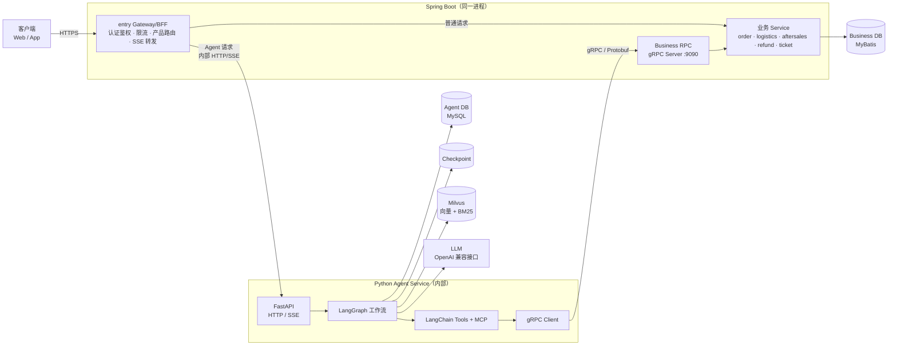
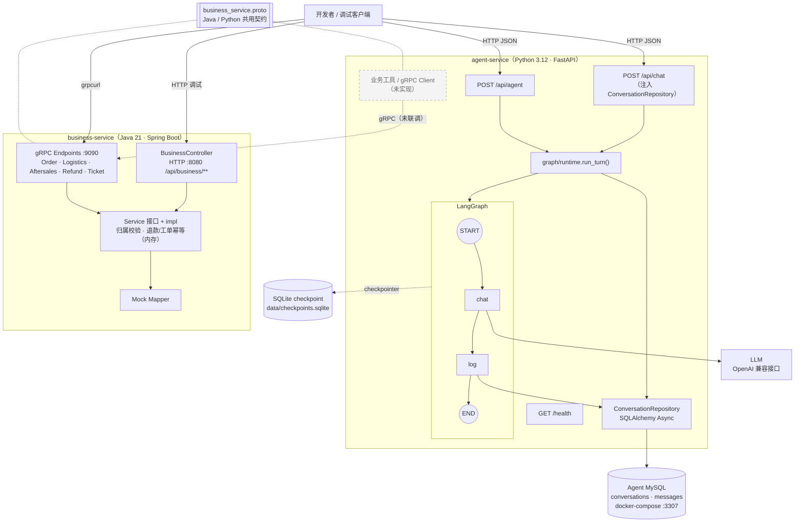
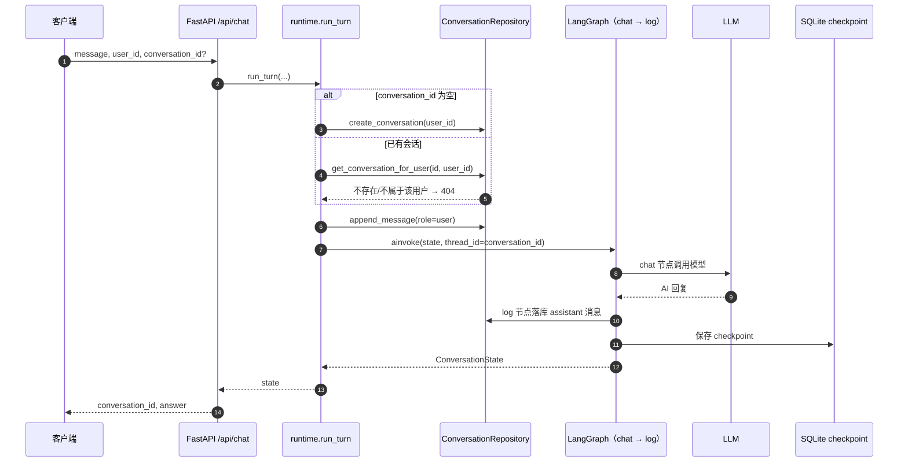
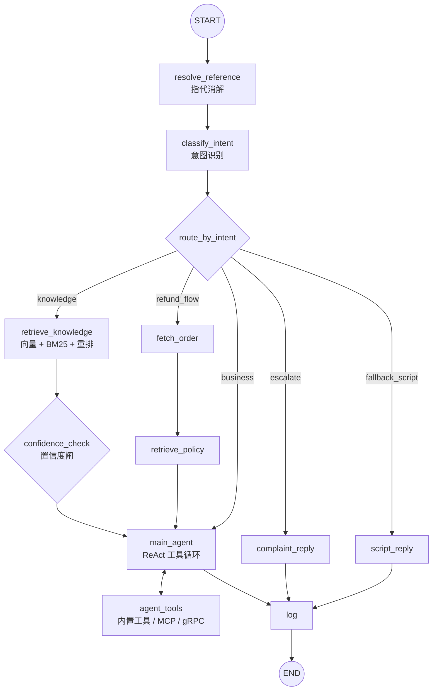
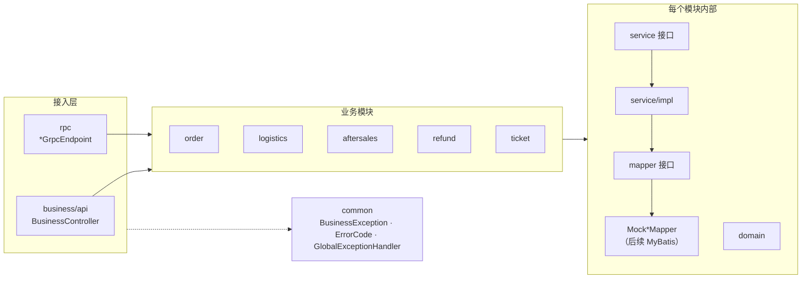

# 灵犀客服架构图

本文用 Mermaid 图描述灵犀客服的目标架构、当前实现与关键链路。图中 **实线/实色** 表示已实现，**虚线/灰色** 表示规划中尚未实现。详细契约与设计见 [总体规格](SPEC.md)。

## 1. 目标架构（E 阶段，尚未实现）

Gateway/BFF 与业务模块同处一个 Spring Boot 项目和进程；Python 是内部 Agent 服务，只回调 Business RPC，不直接访问 Business DB。

## 2. 当前实现（开发阶段拓扑）

统一入口尚未实现，开发时直接请求 Python JSON 接口；Java HTTP 仅用于业务调试；Python 与 Java 的 gRPC 尚未联调。

## 3. 当前对话请求时序（`/api/chat`）

## 4. 目标 LangGraph 工作流（规划）

当前仅实现 `chat → log` 两个节点；下图为 [SPEC 1.3](SPEC.md#13-核心请求链路) 规划的完整链路。

## 5. Business Service 分层

